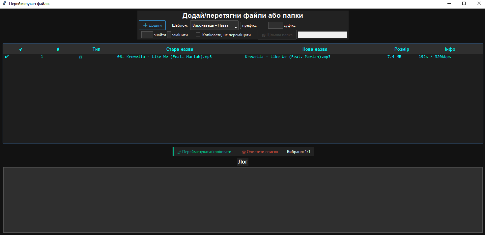

# ✨ Renamer 

> You can drag & drop ➡️ choose template ➡️ press 🚀 - finished!  


---

 


## 📸 Quick Look

| Old name | ➡️ | New name |
|----------|----|----------|
| `01‑Track.mp3` | | `Coldplay - Yellow.mp3` |
| `IMG_20250728.jpg` | | `Holiday in Spain.jpg` |
| `report_final.pdf` | | `01 - report_final.pdf` |

<br>





 
---

## 🌟 Features

- 🎧 **Smart audio tags** - grab Artist & Title from ID3 / FLAC / etc.  
- ✍️ **Templates** - choose `Artist - Title`, `Title (Artist)` or auto‑number `01 - Title`.  
- ✂️ **Prefix / suffix + find/replace** - fast mass edit.  
- 🏷️ **Any file types**: audio, pictures, docs, video, archives - everything gets unique name.  
- 🚚 **Move or copy** checkbox - keep originals safe.  
- 🎯 **Target folder** - dump all new files in one place.  
- 🖱️ **Right‑click menu** - rename single row, delete rows, clear list.  
- 🔄 **Drag & Drop folders** - auto‑scans subdirs too.  
- 🗒️ **Live log** - see what was done ✅ or what failed ❌.  
- 🌑 **Dark UI** with `ttkbootstrap` theme.  
- 📦 **Portable EXE** build → just double click, no Python needed.

---

## 💻 Requirements

| Tool | Tested version |
|------|----------------|
| Python | 3.9 - 3.12 |
| Windows | 10 / 11 |
| Pip packages | `mutagen`, `Pillow`, `tkinterdnd2`, `ttkbootstrap`, `pyinstaller` |

---

## 🚀 Install & Run from GitHub


# 1) clone repo
```powershell
git clone https://github.com/Antot-12/Renamer.git
cd Renamer
```
# 2) create venv (recommended)
```powershell
python -m venv .venv
.venv\Scripts\activate
```

# 3) start app

```powershell
python renamer.py
```

----