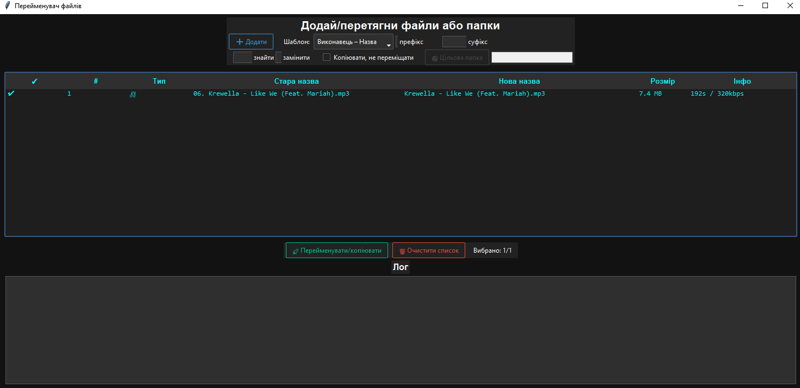

# Renamer

> Drag & drop files, choose a template, press Rename — done!

---

## Quick Look

| Original Name | | New Name |
|---------------|---|----------|
| `01-Track.mp3` | → | `Coldplay - Yellow.mp3` |
| `IMG_20250728.jpg` | → | `2024-07-28 - Vacation.jpg` |
| `report_final.pdf` | → | `01 - report_final.pdf` |

<br>



---

## Features

### Core Renaming
- **Smart Audio Tags** — automatically extracts Artist, Title, Album, Year, Genre from ID3/FLAC/OGG/etc.
- **20+ Templates** — ready-to-use naming patterns for music and general files
- **Prefix / Suffix** — add text before or after filenames
- **Find & Replace** — with optional **Regex support**
- **Case Transformations** — Title Case, UPPER, lower, Sentence case, camelCase, PascalCase, snake_case, kebab-case

### Audio Templates
| Template | Example |
|----------|---------|
| `Виконавець - Назва` | `Coldplay - Yellow.mp3` |
| `Назва - Виконавець` | `Yellow - Coldplay.mp3` |
| `Назва (Виконавець)` | `Yellow (Coldplay).mp3` |
| `## - Виконавець - Назва` | `01 - Coldplay - Yellow.mp3` |
| `Альбом - Назва` | `Parachutes - Yellow.mp3` |
| `[Рік] Виконавець - Назва` | `[2000] Coldplay - Yellow.mp3` |

### File Templates
| Template | Example |
|----------|---------|
| `## - Назва` | `01 - Document.pdf` |
| `ВЕЛИКІ ЛІТЕРИ` | `DOCUMENT.PDF` |
| `snake_case` | `my_document.pdf` |
| `kebab-case` | `my-document.pdf` |
| `camelCase` | `myDocument.pdf` |
| `PascalCase` | `MyDocument.pdf` |
| `Видалити числа` | Removes all digits |
| `Видалити дужки` | Removes `()[]{}` content |

### Advanced Options
- **Batch Numbering** — custom start number, step size, zero-padding
- **Date in Filename** — add creation or modification date with custom format
- **Remove Patterns** — brackets `()[]{}`, numbers, special characters
- **Trim Spaces** — leading, trailing, or multiple spaces

### File Management
- **Sort Files** — by name, date, size, or type (click column headers)
- **Filter by Type** — show only audio, images, documents, etc.
- **Subfolder Support** — recursive scanning with checkbox
- **Duplicate Detection** — find identical files by MD5 hash

### Safety & History
- **Undo/Redo** — revert rename operations instantly
- **Preview** — see all changes before applying
- **Backup Option** — copy originals to backup folder before renaming
- **History Log** — persistent log of all operations with CSV export
- **Profiles** — save and load your favorite rename configurations
- **Export/Import Profiles** — share your presets with others

### Supported File Types
Audio, Images, Documents, Video, Archives, Code, Games, Presentations, and more.

### UI/UX
- **Dark Theme** with cyan accents (ttkbootstrap)
- **Drag & Drop** files and folders
- **Tooltips** — hover over any button for helpful hints
- **Collapsible Advanced Options** — clean interface with power features hidden until needed
- **Context Menu** — right-click for quick actions
- **Live Preview** — see new names as you type
- **Portable EXE** — no Python installation required

---

## Hotkeys

| Key | Action |
|-----|--------|
| `Ctrl+A` | Select all |
| `Ctrl+D` | Deselect all |
| `Ctrl+Z` | Undo |
| `Ctrl+Y` | Redo |
| `Ctrl+P` | Preview changes |
| `F5` | Refresh list |
| `Delete` | Remove selected from list |
| `Double-click` on "New Name" | Edit name manually |
| `Double-click` on image | Preview |

---

## Requirements

| Tool | Version |
|------|---------|
| Python | 3.9 - 3.12 |
| Windows | 10 / 11 |
| macOS | 10.15+ |
| Linux | Ubuntu 20.04+ |

---

## Installation

### Windows (Easiest)

```powershell
# 1) Clone the repository
git clone https://github.com/Antot-12/Renamer.git
cd Renamer

# 2) Run install.bat (installs dependencies)
install.bat

# 3) Run the app
run.bat
```

### Windows / macOS / Linux (with venv)

```bash
# 1) Clone the repository
git clone https://github.com/Antot-12/Renamer.git
cd Renamer

# 2) Create virtual environment
python -m venv .venv

# 3) Activate it
# Windows:
.venv\Scripts\activate
# macOS/Linux:
source .venv/bin/activate

# 4) Install dependencies
pip install -r requirements.txt

# 5) Run
python run.py
```

### Quick Start (no venv)

```bash
pip install mutagen Pillow tkinterdnd2 ttkbootstrap
python run.py
```

---

## Build Portable EXE (Windows)

### Option 1: Using build script (Recommended)

```batch
build.bat
```

This creates a lightweight portable EXE (~15-20 MB) in the `dist/` folder.

### Option 2: Manual build

```bash
pip install pyinstaller
pyinstaller --onefile --windowed --icon=ico.ico --name=Renamer --exclude-module numpy --exclude-module scipy --exclude-module pandas --exclude-module matplotlib run.py
```

The executable will be at `dist/Renamer.exe`

---

## Project Structure

```
Renamer/
├── renamer/              # Main package
│   ├── __init__.py
│   ├── app.py            # GUI application
│   ├── constants.py      # Constants and settings
│   ├── metadata.py       # Metadata extraction
│   ├── file_ops.py       # File operations
│   ├── history.py        # Undo/Redo system
│   ├── transformers.py   # Text transformations
│   ├── duplicates.py     # Duplicate detection
│   ├── history_log.py    # Persistent history
│   ├── musicbrainz.py    # MusicBrainz API integration
│   └── profiles.py       # Profile management
├── tests/                # Test suite (185+ tests)
│   ├── test_transformers.py
│   ├── test_history.py
│   ├── test_duplicates.py
│   ├── test_history_log.py
│   ├── test_profiles.py
│   ├── test_metadata.py
│   └── test_musicbrainz.py
├── run.py                # Entry point
├── run.bat               # Windows launcher
├── install.bat           # Windows installer
├── build.bat             # Build portable EXE
├── requirements.txt      # Dependencies
└── pyproject.toml        # Package configuration
```

---

## Troubleshooting

**ModuleNotFoundError: No module named 'tkinterdnd2'**
```bash
pip install tkinterdnd2 ttkbootstrap mutagen Pillow
```

**Linux: tkinter not found**
```bash
sudo apt install python3-tk
```

**macOS: tkinter issues**
```bash
brew install python-tk
```

**EXE too large?**
Use `build.bat` which excludes unnecessary modules. The resulting EXE should be ~15-20 MB.

---

## Running Tests

```bash
pip install pytest
pytest tests/ -v
```

All 185+ tests should pass.

---

## License

MIT License - use however you want!
